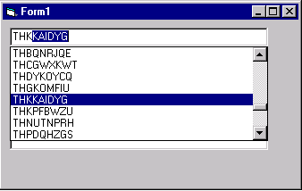

<div align="center">

## Autofill/Autotext


</div>

### Description

Automatically completes text entry according to a listbox contents. Autofill/Autotext uses one text control and one listbox control to simulate an autotext feature. Works fast thanks to SendMessage API (supports loooong lists w/o trouble). Supports Up and Down arrow keys as well as PgUp and PgDn. Enter key behaves like tab. Highly commented code.
 
### More Info
 
To install, read code comments

The only restriction is that you cannot use the mouse wheel to scroll the listbox (mouse wheel launches the lostfocus event of the text box and the list disappears ... should find a way to trap mouse wheel)


<span>             |<span>
---                |---
**Submitted On**   |
**By**             |[tilleul](https://github.com/Planet-Source-Code/PSCIndex/blob/master/ByAuthor/tilleul.md)
**Level**          |Beginner
**User Rating**    |4.1 (29 globes from 7 users)
**Compatibility**  |VB 4\.0 \(32\-bit\), VB 5\.0, VB 6\.0
**Category**       |[Custom Controls/ Forms/  Menus](https://github.com/Planet-Source-Code/PSCIndex/blob/master/ByCategory/custom-controls-forms-menus__1-4.md)
**World**          |[Visual Basic](https://github.com/Planet-Source-Code/PSCIndex/blob/master/ByWorld/visual-basic.md)
**Archive File**   |[](https://github.com/Planet-Source-Code/tilleul-autofill-autotext__1-30645/archive/master.zip)

### API Declarations

```
Private Declare Function SendMessage Lib "User32" Alias "SendMessageA" (ByVal hWnd As Long, ByVal wMsg As Integer, ByVal wParam As Integer, lParam As Any) As Long
Const LB_FINDSTRING = &H18F
```


### Source Code

```
' #########################################################################
' Autofill/Autotext
'
' (c) 2002 Tilleul
' #########################################################################
' Automatically completes text entry according to a listbox contents.
' Autofill/Autotext uses one text control and one listbox control to
' simulate an autotext feature. Works fast thanks to SendMessage API
' (supports loooong lists w/o trouble).
' Supports Up and Down arrow keys as well as PgUp and PgDn.
' Enter key behaves like tab.
' #########################################################################
' To use this code:
' 1- open a new VB project
' 2- draw a textbox control (name = text1)
' 3- draw a listbox control (name = list1)
' 4- change the listbox SORTED property to TRUE
' 5- draw any other controls you want (this is optional, for lostfocus tests)
' 6- copy/paste this is in the form1 code
' #########################################################################
' As long as the text box is edited, it has the focus
' As long as it has the focus, the listbox is displayed
' Using the mouse wheel on the listbox, makes the text box lose the focus
' To avoid this, one should implement a mouse wheel trap
' #########################################################################
' #########################################################################
' API Function SendMessage
Private Declare Function SendMessage Lib "User32" Alias "SendMessageA" (ByVal hWnd As Long, ByVal wMsg As Integer, ByVal wParam As Integer, lParam As Any) As Long
Const LB_FINDSTRING = &H18F
Dim byKey As Boolean    ' is list1_click event activated by a key press ?
Dim byCode As Boolean    ' is text1_change event activated by code ?
Private Sub Form_Load()
' init some things ...
' first, hide list
List1.Visible = False
' set list position
List1.Top = Text1.Top + Text1.Height
List1.Left = Text1.Left
List1.Width = Text1.Width
' set list in front of all objects
List1.ZOrder
' then, let's populate the listbox with random strings
For i = 0 To 10000
  a$ = ""
  For j = 0 To 8
    a$ = a$ & Chr$(Int(Rnd(1) * 26 + 65))
  Next
  List1.AddItem a$
Next
End Sub
Private Sub List1_Click()
' overrides any "list1.visible=false" event-driven code ...
List1.Visible = True
' if the listindex changed because of a key press, we don't need to move the caret
If byKey = True Then
  ' we need to store the caret position because
  ' it'll be zero when we'll update the text
  n = Text1.SelStart
Else
  n = 0
End If
' change text box contents according to item selected
byCode = True  ' avoids calling text1_change event
Text1.Text = List1.List(List1.ListIndex)
byCode = False
' let's change the selected text
Text1.SelStart = n
Text1.SelLength = Len(Text1.Text) - n
End Sub
Private Sub Text1_Change()
' if we come from list1_click event, exit at once
If byCode = True Then Exit Sub
If Len(Text1.Text) <> 0 Then
  ' show the list
  List1.Visible = True
  ' store caret position
  n = Text1.SelStart
  byKey = True
  ' find the listindex of the first occurence of text1.text in listbox1
  p = SendMessage(List1.hWnd, LB_FINDSTRING, -1, ByVal Left$(Text1.Text, n))
  If p >= 0 Then
    If p <> List1.ListIndex Then
      List1.ListIndex = p
    Else
      List1_Click
    End If
  Else
    ' it wasn't found in listbox1 so we don't need what's after the caret anymore
    byCode = True
    Text1.Text = Left$(Text1.Text, n)
    Text1.SelStart = n
    byCode = False
  End If
  byKey = False
Else
  ' hide the list if text1.text is empty
  List1.Visible = False
End If
End Sub
Private Sub Text1_DblClick()
' hides/unhides list1 on double click
' this is a very nice trick (fast too) to avoid using IF x=true THEN x=false ELSE x=true
' remember that TRUE=-1 and FALSE=0
' X = -X - 1 switches from 0 to -1 and -1 to 0 nicely :-)
List1.Visible = -List1.Visible - 1
End Sub
Private Sub Text1_Keydown(KeyCode As Integer, Shift As Integer)
' LSTEP = how many items are scrolled down/up when pressing pgup/pgdn
' a constant here but this can certainly be computed though
Const LSTEP = 10
Select Case KeyCode
  Case vbKeyUp  ' move up the list
    List1.ListIndex = IIf(List1.ListIndex = 0, 0, List1.ListIndex - 1)
    KeyCode = 0
  Case vbKeyDown ' move down the list
    List1.ListIndex = IIf(List1.ListCount - 1 = List1.ListIndex, List1.ListCount - 1, List1.ListIndex + 1)
    KeyCode = 0
  Case vbKeyPageUp  ' scroll up more items
    n = List1.ListIndex - LSTEP
    If n < 0 Then n = 0
    List1.ListIndex = n
  Case vbKeyPageDown ' scroll down more items
    n = List1.ListIndex + LSTEP
    If n > List1.ListCount - 1 Then n = List1.ListCount - 1
    List1.ListIndex = n
  Case vbKeyReturn
    ' when Enter is pressed, make it behave like Tab key
    SendKeys "{TAB}", True
End Select
End Sub
Private Sub Text1_LostFocus()
' focus goes somewhere else, so hide listbox
List1.Visible = False
End Sub
```

